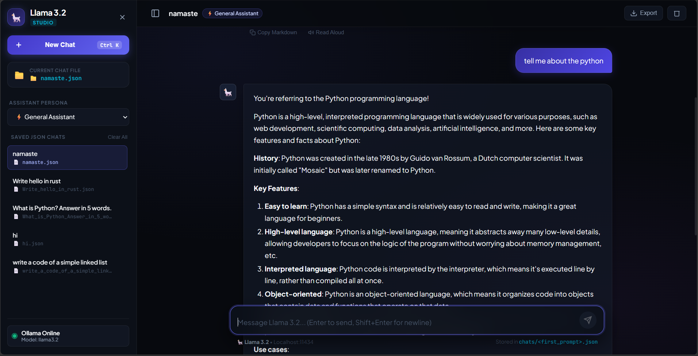
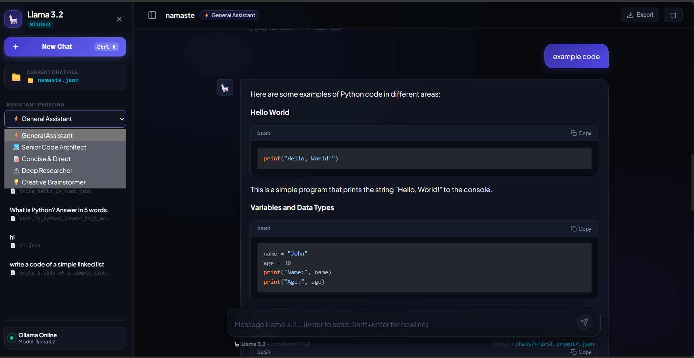

# 🦙 Llama 3.2 Studio

<p align="center">
  <strong>An ultra-fast, local agentic chat studio powered by Ollama and Flask.</strong><br>
  Featuring real-time Server-Sent Events (SSE) streaming, automated prompt-based JSON conversation storage, intelligent persona routing, and an ultra-modern dark glassmorphism UI.
</p>

<p align="center">
  
  
  
  
  
</p>

---

## 📸 Interface Showcase

### 1. Main Studio Chat & File Management
Interactive chat dashboard featuring real-time message streaming, active session indicator, persistent JSON chat list in the sidebar, and live connection status with the local Ollama instance.

<p align="center">
  
</p>

*Alternative direct path: [Screenshot 2026-09-21 111700.png](images/Screenshot%202026-09-21%20111700.png)*

---

### 2. Assistant Persona Selection & Syntax-Highlighted Code
Select custom system personas on the fly and receive syntax-highlighted code blocks with built-in one-click copy, text-to-speech audio playback, and markdown export.

<p align="center">
  
</p>

*Alternative direct path: [Screenshot 2026-09-21 111742.png](images/Screenshot%202026-09-21%20111742.png)*

---

## 🌟 Key Features

- **⚡ Real-time Token Streaming**: Uses Server-Sent Events (`text/event-stream`) to deliver tokens from Llama 3.2 as they are generated with zero perceivable latency.
- **📁 Automated JSON Chat Persistence**:
  - Each chat session is automatically persisted to an individual JSON file inside the `chats/` directory.
  - Automatically derives and sanitizes safe filenames from the user's initial prompt (e.g., `tell_me_about_the_python.json`).
  - Thread-safe file access using dedicated re-entrant per-file locks.
- **🎭 AI Assistant Personas**:
  - ⚡ **General Assistant**: Versatile, helpful responses.
  - 💻 **Senior Code Architect**: Production-ready code, architectural best practices, and clean patterns.
  - 📑 **Concise & Direct**: Straight-to-the-point answers with minimal fluff.
  - 🔬 **Deep Researcher**: Analytical, nuanced explanations with comprehensive context.
  - 💡 **Creative Brainstormer**: Out-of-the-box ideas and unconventional problem solving.
- **🎨 Glassmorphic Dark UI**:
  - Built with custom CSS design tokens (`Plus Jakarta Sans` & `JetBrains Mono`).
  - Smooth hover interactions, glowing accents, and collapsible sidebar.
- **🛠️ Rich Message Actions**:
  - **Syntax Highlighting**: Pre-rendered syntax highlighting via Highlight.js for Python, Bash, JavaScript, Rust, and more.
  - **One-Click Code Copy**: Instantly copy code blocks with visual feedback.
  - **Markdown Copy & Export**: Copy or export full conversation logs.
  - **Text-to-Speech (Read Aloud)**: Web Speech API integration for audible responses.
- **🟢 Live Health Monitoring**:
  - Automatic polling of `/api/status` to detect whether Ollama is active and if the `llama3.2` model is loaded.

---

## 🏗️ Project Architecture

```plaintext
2311cs04003_agenticai_lab_exam/
├── app.py                     # Flask application server & Ollama streaming API
├── requirements.txt           # Python package dependencies
├── chats/                     # Storage folder for session JSON files
│   ├── namaste.json
│   ├── Write_hello_in_rust.json
│   └── ...
├── images/                    # UI screenshots & preview images for README
│   ├── llama_studio_chat.png
│   ├── llama_studio_personas_code.png
│   ├── Screenshot 2026-09-21 111700.png
│   └── Screenshot 2026-09-21 111742.png
├── static/
│   ├── css/
│   │   └── style.css          # Custom styling & glassmorphic tokens
│   └── js/                    # Client-side streaming and UI controllers
└── templates/
    └── index.html             # Main single-page application template
```

---

## 🔌 API Endpoints

| Method | Endpoint | Description |
| :--- | :--- | :--- |
| `GET` | `/` | Serves the single-page application web UI |
| `GET` | `/api/status` | Checks Ollama service connectivity and model availability |
| `GET` | `/api/chats` | Lists all saved chat files with metadata (title, persona, timestamps) |
| `GET` | `/api/chats/<filename>` | Retrieves the full conversation history for a given session |
| `DELETE` | `/api/chats/<filename>` | Deletes a specific chat JSON file |
| `DELETE` | `/api/chats` | Clears all saved chats |
| `POST` | `/api/chat` | Handles streaming (SSE) or synchronous chat with Ollama |

---

## 🚀 Quick Start Guide

### 1. Prerequisites
- **Python 3.10+** (Tested on Python 3.11)
- **Ollama** installed and running on your system. ([Download Ollama](https://ollama.com/download))

Make sure the Llama 3.2 model is pulled:
```bash
ollama run llama3.2
```

### 2. Clone the Repository
```bash
git clone https://github.com/<your-username>/<your-repo-name>.git
cd <your-repo-name>
```

### 3. Create and Activate Virtual Environment (Optional but Recommended)
```bash
# Windows
python -m venv venv
venv\Scripts\activate

# Linux / macOS
python3 -m venv venv
source venv/bin/activate
```

### 4. Install Dependencies
```bash
pip install -r requirements.txt
```

### 5. Start the Application
```bash
python app.py
```

Open your browser and navigate to:
```
http://127.0.0.1:5000
```

---

## 💬 Sample Stored Chat Structure (`chats/*.json`)

Conversations are automatically persisted with clean metadata:
```json
{
  "filename": "namaste.json",
  "title": "namaste",
  "created_at": "2026-09-21T11:15:30.123456",
  "updated_at": "2026-09-21T11:17:42.654321",
  "persona": "General Assistant",
  "messages": [
    {
      "role": "user",
      "content": "tell me about the python",
      "timestamp": "2026-09-21T11:16:36.100000"
    },
    {
      "role": "assistant",
      "content": "Python is a high-level, interpreted programming language...",
      "timestamp": "2026-09-21T11:16:36.200000"
    }
  ]
}
```

---

## 🎓 Academic / Exam Submission Details

- **Candidate Roll No / Identifier**: `2311cs04003`
- **Course / Assessment**: Agentic AI Lab Examination
- **Target Model**: Meta Llama 3.2 (`llama3.2`) via Ollama

---

## 📄 License
This project is developed for educational and research purposes under the Agentic AI Lab Examination.